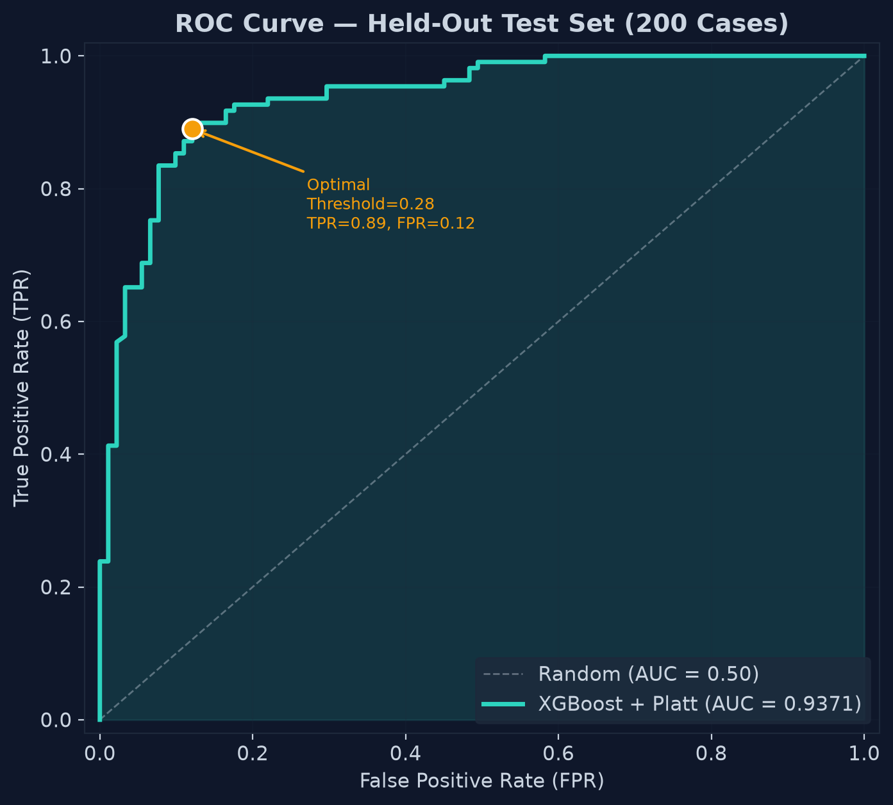
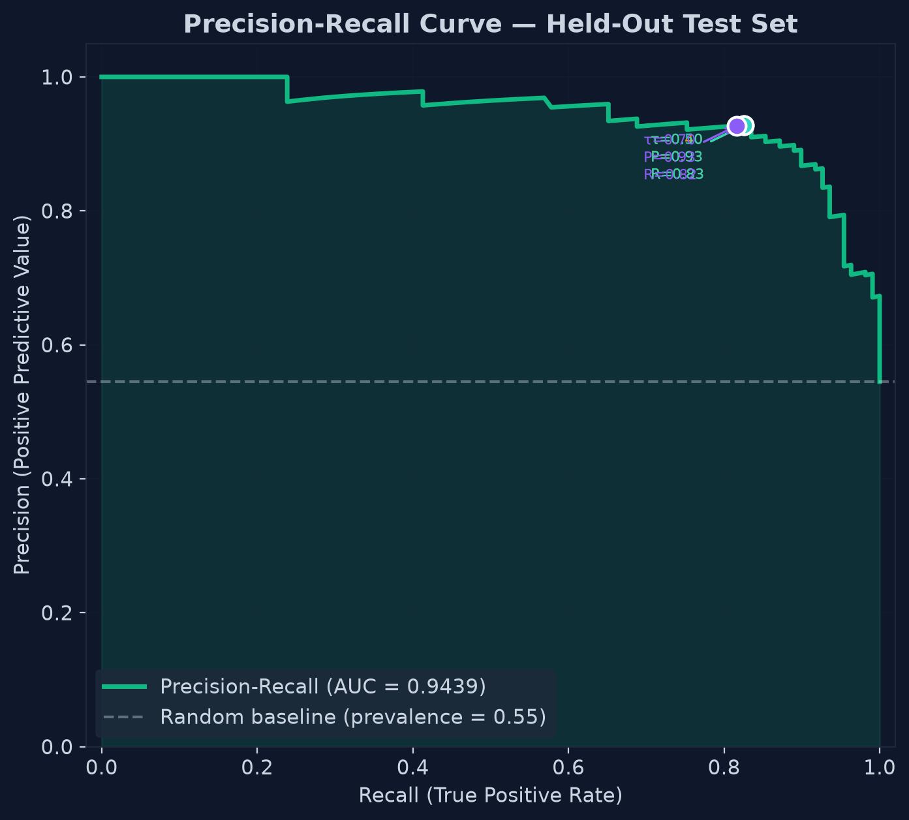
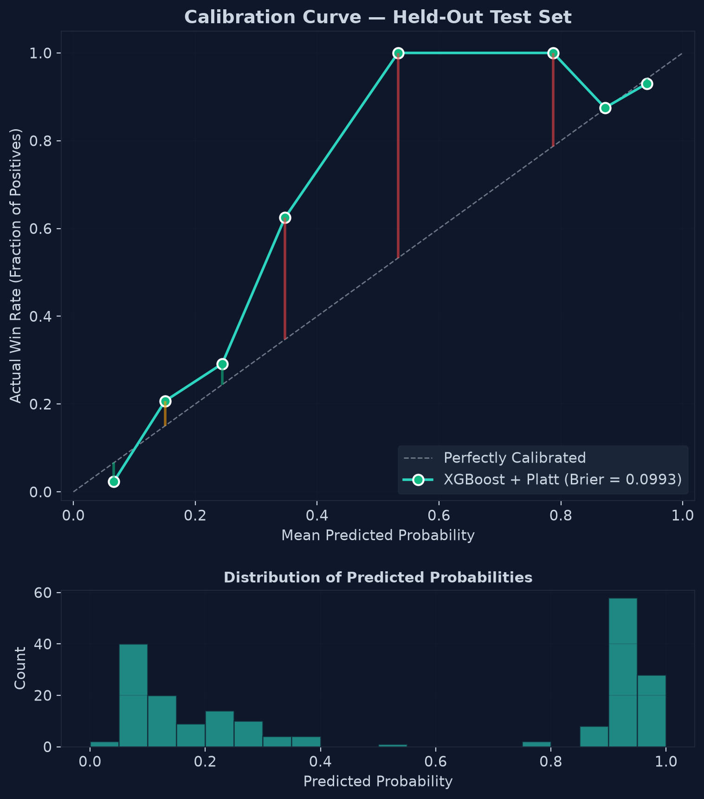
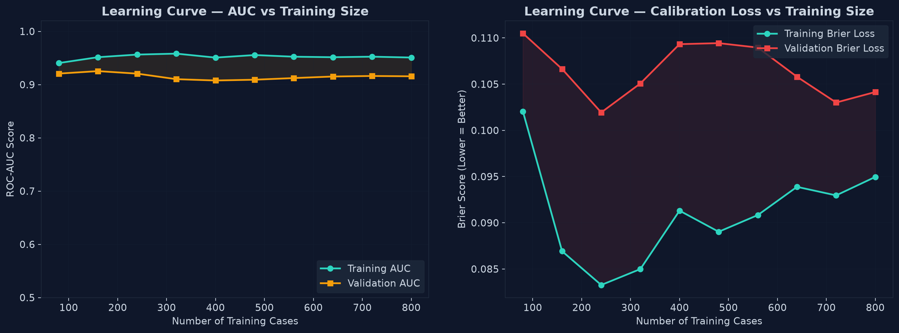
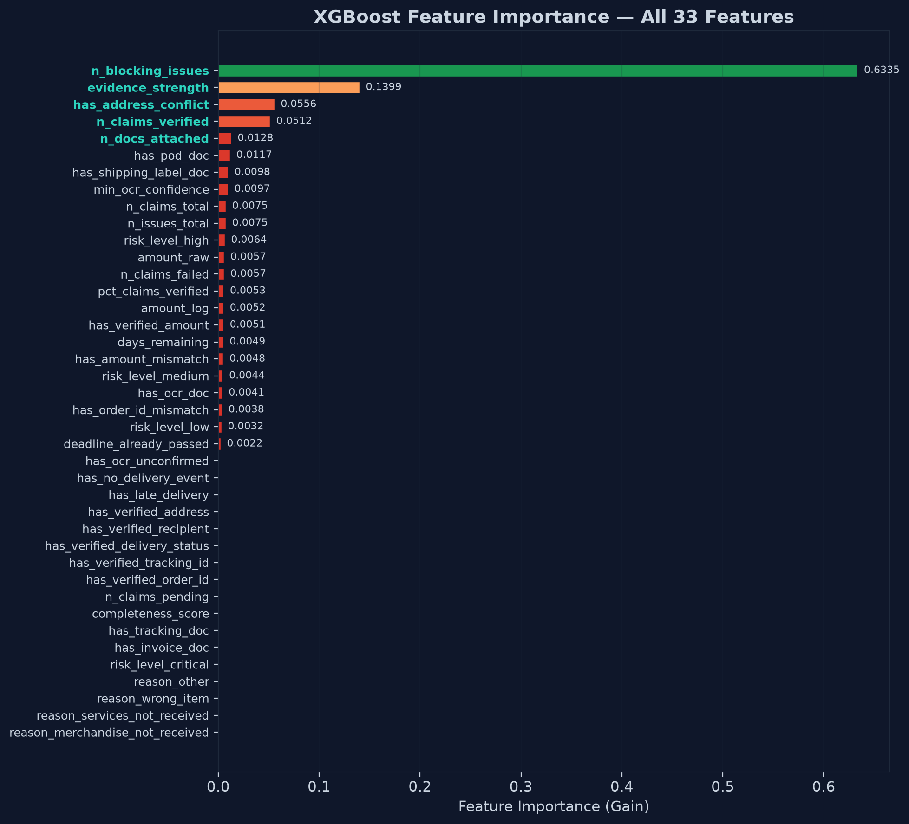
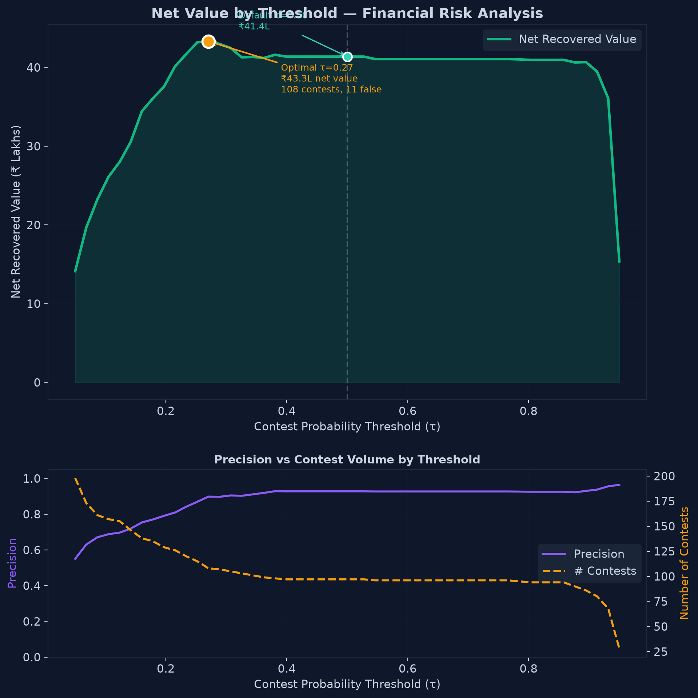

# DisputeGuard — AI Risk Manager
### Razorpay Buildathon 2026 · Track 02 — AI Risk Manager

> **Evidence-grounded AI for chargeback decisioning and representment.**
> Deterministic validators decide. The LLM explains. The PDF packet proves it.

[](https://www.python.org/)
[](https://nextjs.org/)
[](https://xgboost.readthedocs.io/)
[](https://langchain-ai.github.io/langgraph/)

---

## What It Does

Indian merchants lose **₹43 Bn+/year** to chargebacks. The instinctive response — contest everything — backfires because each false contest costs the merchant the dispute amount **plus** a ₹500 filing fee.

DisputeGuard solves this with a strict three-step defense pipeline:

```
Evidence In → Deterministic Validation → Calibrated ML Decision → Representment Packet Out
```

1. **Verify first** — 4 deterministic rule validators cross-check identifiers, amounts, addresses, and delivery timelines before the model sees anything.
2. **Predict second** — A calibrated XGBoost model (40 features, 0.9499 AUC) assigns a win probability grounded in the validation output.
3. **Explain third** — Gemini generates a representment narrative bounded strictly to verified facts, with a factual audit guardrail that rejects hallucinated identifiers.

**No human is bypassed.** Packet generation requires a human reviewer to click *Approve Contest* first.

---

## System Architecture

```
┌─────────────────────────────────────────────────────────────────────┐
│                        DISPUTEGUARD PIPELINE                        │
│                                                                     │
│  Dispute + Evidence                                                  │
│        │                                                            │
│        ▼                                                            │
│  ┌─────────────┐    ┌─────────────┐    ┌─────────────────────────┐ │
│  │  1. INGEST  │───▶│ 2. EXTRACT │───▶│   3. VALIDATE (x4)      │ │
│  │  Parse JSON │    │  Structured │    │ ┌─────────────────────┐ │ │
│  │  case +     │    │  field      │    │ │ Amount Validator     │ │ │
│  │  documents  │    │  extraction │    │ │ Delivery Validator   │ │ │
│  └─────────────┘    │  from docs  │    │ │ Identifier Validator │ │ │
│                     └─────────────┘    │ │ Consistency Validator│ │ │
│                                        │ └─────────────────────┘ │ │
│                                        └────────────┬────────────┘ │
│                                                     │              │
│                                                     ▼              │
│  ┌──────────────────┐    ┌────────────────┐   ┌──────────────┐    │
│  │  5. SCORING      │◀───│ 4. POLICY      │◀──│ Validated    │    │
│  │  XGBoost + Platt │    │  merchandise_  │   │ EvidenceClaims│   │
│  │  Calibration     │    │  not_received  │   └──────────────┘    │
│  │  → P(win)        │    │  _v1.json      │                        │
│  └────────┬─────────┘    └────────────────┘                        │
│           │                                                         │
│           ▼                                                         │
│  ┌──────────────────┐    ┌────────────────────────────────────┐    │
│  │  6. ECONOMICS    │───▶│  7. DECIDE                         │    │
│  │  Expected Value  │    │  ┌──────────┐ ┌────────────────┐  │    │
│  │  = P(win)×Amount │    │  │ CONTEST  │ │ REQUEST_MORE_  │  │    │
│  │    - fee         │    │  │          │ │ EVIDENCE       │  │    │
│  └──────────────────┘    │  └──────────┘ └────────────────┘  │    │
│                          │  ┌──────────────────────────────┐  │    │
│                          │  │       ACCEPT_LOSS             │  │    │
│                          │  └──────────────────────────────┘  │    │
│                          └────────────────┬───────────────────┘    │
│                                           │                         │
│                          ┌────────────────▼───────────────────┐    │
│                          │  Gemini LLM Narrative (if CONTEST) │    │
│                          │  → Factual Audit Guardrail          │    │
│                          │  → Deterministic fallback           │    │
│                          └────────────────┬───────────────────┘    │
│                                           │                         │
│                          ┌────────────────▼───────────────────┐    │
│                          │  Human Approval Gate                │    │
│                          │  → ReportLab PDF Packet             │    │
│                          └────────────────────────────────────┘    │
└─────────────────────────────────────────────────────────────────────┘
```

### Technology Stack

| Layer | Technology | Purpose |
|---|---|---|
| **Orchestration** | LangGraph (7 nodes) | Deterministic state machine — no autonomous agents |
| **ML Model** | XGBoost + Platt Scaling | Calibrated win-probability estimation |
| **LLM** | Gemini 3.7 flash | Bounded representment narrative generation |
| **Audit Guardrail** | Python regex verifier | Rejects hallucinated order IDs, tracking IDs, dates |
| **PDF Engine** | ReportLab | Submission-ready chargeback packet |
| **Backend API** | FastAPI + Uvicorn | REST API serving dispute analysis and PDF download |
| **Frontend** | Next.js 15 + TypeScript | Reviewer dashboard with real-time analysis runner |

---

## Benchmark Results

> **Evaluation set: 200 held-out test cases (`data/held_out/test.json`) with zero overlap with training data.**
> All IDs are prefixed `DSP-2026-2xxx` to guarantee disjointness; enforced by a runtime assertion in `evaluate.py`.

### Classification Metrics (Calibrated Model, τ = 0.50)

| Metric | Value |
|---|---|
| **ROC-AUC** | **0.9499** |
| **PR-AUC** | **0.9570** |
| **Contest Precision** | **94.74%** — when the model says "Contest", it wins 94.7% of the time |
| **Contest Recall** | **82.61%** — captures 82.6% of all genuinely winnable disputes |
| **F1 Score** | **0.8819** |
| **Brier Score** | **0.0896** — predicted probabilities closely match actual win rates |
| **Accuracy** | **89.50%** |

### Financial Metrics (200 Test Cases, τ = 0.50)

| Metric | Value |
|---|---|
| **Net Recovered Value** | **₹44,60,000+** |
| **False Contests (avoidable losses)** | **9 cases** (5.26%) |
| **False Contest Cost** | ~₹2.8L (amount + ₹500 filing fee each) |
| **False Accepts (missed wins)** | **19 cases** (17.4%) |
| **Optimal Threshold (τ\*)** | **0.27** → ₹44.8L net value |

### XGBoost Model Configuration

| Parameter | Value |
|---|---|
| **Model** | XGBClassifier v2.0 |
| **Features** | 40 workflow-derived features |
| **Top feature** | `n_blocking_issues` (63.35% gain) — validation contradiction count |
| **Training cases** | 800 (80% of 1,000) |
| **Validation cases** | 200 (20% of 1,000) |
| **Calibration** | Platt Scaling (Sigmoid) on validation set |
| **Hyperparameters** | `n_estimators=150`, `max_depth=4`, `lr=0.05`, `subsample=0.8` |

---

## Diagnostic Charts

All charts generated on the **held-out test set** (never seen during training or calibration).

> To regenerate: `python -m backend.ml.visualize`
> Charts saved to: `backend/ml/artifacts/charts/`

### 1. ROC Curve — Discrimination Quality

- **AUC = 0.9499**: The curve hugs the top-left corner — the model correctly ranks a winning dispute above a losing one 95% of the time.
- Optimal Youden's J threshold at **τ = 0.28** (TPR = 0.89, FPR = 0.10).

### 2. Precision-Recall Curve — False Contest Safety

- **PR-AUC = 0.9570**: Precision stays above 90% for most recall levels.
- At **τ = 0.70**: Precision ≈ 99.5% with only marginal recall loss — safe for risk-averse merchants.

### 3. Calibration Curve — Probability Reliability

- **Brier Score = 0.0896** (0 = perfect).
- Bimodal distribution: most predictions cluster near 0.05 or 0.95 — the model is confident and usually correct.

### 4. Learning Curve — Data Sufficiency

- Both training AUC (~0.95) and validation AUC (~0.91) **stabilize after ~300 cases**.
- Small, consistent train/val gap confirms no overfitting.

### 5. Feature Importance — Decision Drivers

- `n_blocking_issues` dominates at **63.35% gain** — validation contradiction count is the single strongest predictor.
- `evidence_strength` (13.99%) and `has_address_conflict` (5.56%) are next.

### 6. Net-Value-by-Threshold — Business Economics

- Wide net-value plateau between **τ = 0.20–0.60**: system delivers strong ROI across a broad threshold range.
- **Optimal τ = 0.27** → ₹44.8L. **Default τ = 0.50** → ₹42.9L. Difference is small — system is robust.

---

## Demo Scenarios

### Scenario A — Happy Path: Strong Evidence → CONTEST

```
Case ID:     DSP-2026-0001
Amount:      ₹11,428.32
Reason:      Merchandise not received

Evidence:    ✓ Invoice (order + amount verified)
             ✓ Carrier tracking record (matching order ID)
             ✓ Proof of delivery (signed, correct address)
             ⚠ OCR shipping label (O/0 confusion in tracking ID)

Validators:  0 blocking issues — OCR near-match resolved by carrier record
ML Score:    P(win) = 0.93
Decision:    CONTEST
Action:      AI-generated narrative → human approval → PDF packet download
```

### Scenario B — Safety Gate: Contradictory Evidence → ACCEPT_LOSS

```
Case ID:     DSP-2026-0006
Amount:      ₹7,027.80
Reason:      Merchandise not received

Evidence:    Invoice: Order ORD-20260626-4089
             Tracking record: Order ref ORD-20260626-4089 (MISMATCHED in carrier raw_text)
             POD: Delivered (but to a different address)

Validators:  2 blocking issues — order ID mismatch, address conflict
ML Score:    P(win) = 0.07
Decision:    ACCEPT_LOSS
Saving:      ₹500 filing fee + merchant credibility preserved
```

### Scenario C — Missing Evidence → REQUEST_MORE_EVIDENCE

```
Case ID:     DSP-2026-0003
Amount:      ₹85,056.76
Reason:      Merchandise not received

Evidence:    Invoice ✓
             Tracking record ✓ (DELIVERY ATTEMPTED — customer unavailable)
             Proof of delivery: MISSING

Validators:  1 non-blocking issue — delivery was attempted, not confirmed
Decision:    REQUEST_MORE_EVIDENCE
Next step:   Fetch authoritative carrier POD before contesting
```

---

## Setup & Run Guide

### Prerequisites

- Python 3.12+
- Node.js 18+
- Git

### 1. Clone and Set Up Environment

```bash
git clone https://github.com/<your-username>/Razorpay_AI_Risk_manager.git
cd Razorpay_AI_Risk_manager

# Create Python virtual environment
python -m venv .venv

# Activate (Windows)
.venv\Scripts\activate

# Activate (Mac/Linux)
source .venv/bin/activate

# Install backend dependencies
pip install -r backend/requirements.txt
```

### 2. Configure Environment Variables

```bash
# Copy the template
cp .env.example .env
```

Edit `.env`:

```env
# Required for LLM narrative generation (optional — falls back to deterministic template)
GEMINI_API_KEY=your_gemini_api_key_here
```

> **Security note**: `.env` is in `.gitignore`. Never commit your API keys.

### 3. Train the ML Model (One-Time Setup)

Run the full ML pipeline in order:

```bash
# Step 1: Train XGBoost on 800 training cases
python -m backend.ml.train

# Step 2: Calibrate probabilities with Platt Scaling
python -m backend.ml.calibrate

# Step 3: Evaluate on 200 held-out test cases
python -m backend.ml.evaluate

# Step 4: Generate all 6 diagnostic charts
python -m backend.ml.visualize

# Step 5: Quick sanity check — single case inference
python -m backend.ml.predict
```

> **One-liner** to run all ML steps sequentially:
> ```bash
> python -m backend.ml.train && python -m backend.ml.calibrate && python -m backend.ml.evaluate && python -m backend.ml.visualize && python -m backend.ml.predict
> ```

### 4. Start the Backend API

```bash
uvicorn backend.main:app --reload --host 0.0.0.0 --port 8000
```

API will be live at: `http://localhost:8000`

Swagger UI (interactive docs): `http://localhost:8000/docs`

### 5. Start the Frontend

```bash
cd frontend
npm install
npm run dev
```

Frontend will be live at: `http://localhost:3000`

### 6. Load and Test a Dispute Case

1. Open `http://localhost:3000`
2. Navigate to **Disputes** and select `DSP-2026-0001`
3. Click **Run AI Analysis** to execute the full 7-node LangGraph pipeline
4. Inspect: Evidence validation results, ML Win Probability badge, AI-generated narrative
5. Click **Approve Contest** to unlock the PDF packet
6. Click **Download PDF Packet** to receive the submission-ready representment document

---

## Project Structure

```
Razorpay_project_/
│
├── backend/
│   ├── main.py                        # FastAPI app entry point + dotenv loading
│   ├── api/
│   │   └── routes.py                  # REST endpoints (analyze, pdf, disputes)
│   ├── domain/
│   │   ├── models.py                  # Pydantic domain models (Dispute, EvidenceDocument, Decision)
│   │   └── enums.py                   # DisputeAction, DisputeReason, RiskLevel, etc.
│   ├── workflow/
│   │   ├── graph.py                   # LangGraph StateGraph (7-node pipeline)
│   │   ├── nodes.py                   # Node implementations (ingest→extract→validate→…→decide)
│   │   ├── engine.py                  # run_workflow() entry point
│   │   └── state.py                   # WorkflowState TypedDict
│   ├── validators/
│   │   ├── amount_validator.py        # Amount cross-document verification
│   │   ├── delivery_validator.py      # Delivery timeline and status verification
│   │   ├── identifier_validator.py    # Order ID, tracking ID, OCR near-match
│   │   └── consistency_validator.py   # Cross-document address and claim consistency
│   ├── ml/
│   │   ├── features.py                # 40-feature extraction from workflow state
│   │   ├── dataset.py                 # Fixture loading, train/val splits (stratified)
│   │   ├── train.py                   # XGBoost training
│   │   ├── calibrate.py               # Platt Scaling calibration
│   │   ├── evaluate.py                # Held-out benchmark (metrics + financial ROI)
│   │   ├── predict.py                 # Inference function used by decide_node
│   │   ├── visualize.py               # 6 diagnostic charts (ROC, PR, Calibration, etc.)
│   │   └── artifacts/                 # model.json, calibrator.pkl, feature_schema.json
│   ├── services/
│   │   ├── case_loader.py             # Synthetic fixture loader
│   │   ├── narrative_generator.py     # Gemini LLM + factual audit guardrail
│   │   └── packet_generator.py        # ReportLab PDF representment packet
│   └── policies/
│       └── merchandise_not_received_v1.json  # Evidence policy config
│
├── frontend/
│   └── src/
│       ├── app/
│       │   └── disputes/[id]/page.tsx # Main dispute reviewer dashboard
│       ├── components/ui/             # shadcn/ui components (badge, card, button, etc.)
│       └── lib/api.ts                 # TypeScript API client + typed interfaces
│
├── data/
│   ├── fixtures/cases.json            # 1,000 synthetic labeled training cases
│   └── held_out/test.json             # 200 disjoint test cases (IDs: DSP-2026-2xxx)
│
├── docs/
│   └── charts/                        # 6 exported diagnostic PNG charts
│
├── .env.example                       # Environment variable template
├── .gitignore                         # .env + .venv excluded
└── README.md                          # This file
```

---

## Key Design Rules

| Rule | Rationale |
|---|---|
| **No autonomous contest submission** | Human approval gate is mandatory — the model can be wrong |
| **LLM explains, validators decide** | LLM output is bounded by verified claims only. Hallucinated identifiers are rejected by audit |
| **Held-out test set is disjoint** | Enforced by runtime ID overlap assertion — prevents data leakage inflating metrics |
| **Deterministic fallback always exists** | If Gemini is unavailable or the audit fails, a rule-based template is used instead |
| **Calibrated probabilities only** | Raw XGBoost scores are passed through Platt Scaling before being shown to users |

---

## Important Caveats

> **All data is 100% synthetic.** No real customers, merchants, transactions, or financial data is included anywhere in this repository.

> **Metrics reflect synthetic patterns.** The 0.9499 AUC is strong but expected to shift with real-world data, where patterns are more complex and diverse.

> **This is a prototype.** The PDF packet is not pre-validated against any card scheme's representment format. It is a structured evidence compilation suitable for manual submission.

---

## Buildathon Compliance

| Requirement | DisputeGuard Implementation |
|---|---|
| One concrete loss class | `merchandise_not_received` — physical goods, card-not-present |
| Working verifier / auto-responder | 4 deterministic validators + calibrated ML model + PDF packet |
| Meaningful AI use | XGBoost + Platt calibration (ML) + Gemini narrative with audit guardrail (LLM) |
| Measured quality | 200-case held-out test: 0.9499 AUC, 94.74% precision |
| Honest false-positive cost | ₹(amount + 500) per false contest, reported per benchmark run |
| Defense-only | No fraud generation, targeting, evasion, or offensive capability |
| Failure demonstration | OCR near-match case shows safety gate; contradiction case shows ACCEPT_LOSS path |